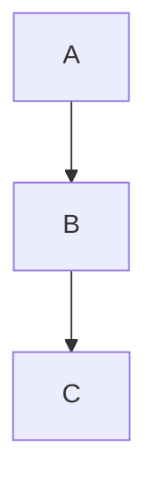

# ADR-001: Нативная поддержка Mermaid диаграмм через плагин Mermaid Diagrams for Confluence

**Статус:** Реализовано

**Дата:** 2025-05-07

## Контекст

В текущей реализации mark (fork kovetskiy/mark) mermaid-диаграммы обрабатываются следующим образом:
1. Парсер обнаруживает fenced code block с языком `mermaid`
2. Вызывается `mermaid.ProcessMermaidLocally()` — локальный рендеринг в PNG через библиотеку `mermaid.go`
3. PNG загружается как attachment на страницу Confluence
4. В тело страницы вставляется тег `<ac:image>` с ссылкой на attachment

**Проблема:** На нашем Confluence установлен плагин **Mermaid Diagrams for Confluence** (макрос `mermaid-cloud`), который поддерживает нативное отображение mermaid-диаграмм (интерактивность, SVG, масштабирование). Локальный рендеринг в PNG не использует эти возможности.

## Исследование

### Как работает плагин mermaid-cloud

Из анализа API Confluence (страница "Enterprise Service Bus и Data LakeHouse [Current State]"):

```xml
<ac:structured-macro ac:name="mermaid-cloud" ac:schema-version="1" ac:macro-id="...">
  <ac:parameter ac:name="toolbar">bottom</ac:parameter>
  <ac:parameter ac:name="filename">Current State</ac:parameter>
  <ac:parameter ac:name="format">svg</ac:parameter>
  <ac:parameter ac:name="zoom">fit</ac:parameter>
  <ac:parameter ac:name="revision">2</ac:parameter>
</ac:structured-macro>
```

**Ключевое ограничение:** Плагин НЕ поддерживает inline-диаграммы через `<ac:plain-text-body>`. Диаграмма должна быть загружена как **attachment-файл** (параметр `filename` указывает имя attachment).

### Анализ возможности использования Custom Macro

Custom macros (определяемые через HTML-комментарии `<!-- Macro: ... -->`) выполняют только текстовую замену в markdown. Они **не могут** загружать attachment-файлы через API. Поэтому чистый Custom Macro подход невозможен — требуется изменение кода mark.

## Решение

Добавить новый feature flag `mermaid-cloud`, который при включении:
1. Берёт **сырой текст** mermaid-диаграммы из fenced code block
2. Создаёт attachment-файл `.md` с текстом диаграммы
3. Загружает его на страницу через существующий механизм attachment
4. Генерирует XML макроса `mermaid-cloud` с `filename` → имя attachment

### Использование в markdown

```markdown

```

### Результат на Confluence

1. Загружен attachment `My Diagram.md` с текстом диаграммы
2. В тело страницы вставлен макрос:

```xml
<ac:structured-macro ac:name="mermaid-cloud" ac:schema-version="1">
  <ac:parameter ac:name="filename">My Diagram.md</ac:parameter>
  <ac:parameter ac:name="format">svg</ac:parameter>
  <ac:parameter ac:name="zoom">fit</ac:parameter>
  <ac:parameter ac:name="toolbar">bottom</ac:parameter>
</ac:structured-macro>
```

## Внесённые изменения

### 1. `stdlib/stdlib.go` — Добавлен шаблон `ac:mermaid-cloud`

```go
`ac:mermaid-cloud`: text(
    `<ac:structured-macro ac:name="mermaid-cloud" ac:schema-version="1">`,
    `<ac:parameter ac:name="filename">{{ .Filename | xmlesc }}</ac:parameter>`,
    `<ac:parameter ac:name="format">{{ or .Format "svg" }}</ac:parameter>`,
    `<ac:parameter ac:name="zoom">{{ or .Zoom "fit" }}</ac:parameter>`,
    `<ac:parameter ac:name="toolbar">{{ or .Toolbar "bottom" }}</ac:parameter>`,
    `</ac:structured-macro>`,
),
```

### 2. `renderer/fencedcodeblock.go` — Добавлена ветка для `mermaid-cloud`

Новая ветка **перед** существующей `mermaid` веткой (приоритет mermaid-cloud > mermaid).
При отсутствии `title` генерируется уникальное имя по SHA-256 хэшу содержимого (первые 8 символов):

```go
} else if lang == "mermaid" && slices.Contains(r.MarkConfig.Features, "mermaid-cloud") {
    diagramName := title
    if diagramName == "" {
        hash := sha256.Sum256(lval)
        diagramName = "mermaid-" + hex.EncodeToString(hash[:])[:8]
    }
    att := attachment.Attachment{
        Name:      diagramName,
        Filename:  diagramName + ".md",
        FileBytes: lval,
        Replace:   diagramName,
    }
    r.Attachments.Attach(att)
    
    err := r.Stdlib.Templates.ExecuteTemplate(writer, "ac:mermaid-cloud", ...)
```

### 3. `util/flags.go` — Обновлено описание features

```
"Enables optional features. Current features: d2, mermaid, mermaid-cloud, mention, mkdocsadmonitions"
```

### 4. `renderer/fencedcodeblock_test.go` — Добавлены unit-тесты

5 тестов покрывающих:
- Диаграмма с `title` → имя из title
- Диаграмма без `title` → хэш-имя
- Несколько безымянных диаграмм → разные имена
- Одинаковое содержимое → одинаковый хэш
- Feature `mermaid` (без `-native`) → не генерирует `mermaid-cloud`

## Запуск

```bash
mark --features mermaid-cloud,mention ...
```

Или через конфиг:

```toml
features = ["mermaid-cloud", "mention"]
```

## Выполненные работы

- [x] Сборка и проверка компиляции (`go build ./...`) — ✅ успешно
- [x] Исправлена ошибка компиляции: `err =` → `err :=` в mermaid-cloud ветке
- [x] Запуск существующих тестов (`go test ./...`) — ✅ все проходят (кроме d2/mermaid из-за отсутствия chrome)
- [x] Добавление unit-теста для нового функционала — ✅ 5 тестов в `renderer/fencedcodeblock_test.go`
- [x] Проверка: при `mermaid-cloud` без `title` — генерируется хэш-имя `mermaid-<sha256[:8]>`
- [x] Генерация уникального имени по SHA-256 хэшу содержимого при отсутствии title

## Остаток работы

- [ ] Проверка на реальной Confluence странице (ручное тестирование)
- [ ] Рассмотреть: кастомизация параметров макроса (`format`, `zoom`, `toolbar`) через metadata или опции fenced block

## Риски

1. ~~**Конфликт имён attachment**~~ — **РЕШЕНО**: при отсутствии `title` генерируется уникальное имя по SHA-256 хэшу содержимого (`mermaid-<hash8>.md`). Одинаковое содержимое → одинаковый хэш (content-addressable).
2. **Совместимость плагина** — параметры макроса (`format`, `zoom`, `toolbar`) захардкожены. Если нужны другие значения — потребуется расширение (через metadata или опции fenced block).
3. **Порядок feature flags** — `mermaid-cloud` проверяется перед `mermaid`. Если включены оба, `mermaid-cloud` имеет приоритет. Это задуманное поведение.
