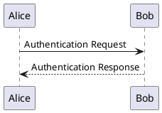

# Mark

<!-- ALL-CONTRIBUTORS-BADGE:START - Do not remove or modify this section -->
[](#contributors-)
<!-- ALL-CONTRIBUTORS-BADGE:END -->

Mark — a tool for syncing your markdown documentation with Atlassian Confluence
pages.

This is very useful if you store documentation to your software in a Git
repository and don't want to do an extra job of updating Confluence page using
a tinymce wysiwyg enterprise core editor which always breaks everything.

Mark does the same but in a different way. Mark reads your markdown file, creates a Confluence page
if it's not found by its name, uploads attachments, translates Markdown into HTML and updates the
contents of the page via REST API. It's like you don't even need to create sections/pages in your
Confluence anymore, just use them in your Markdown documentation.

Mark uses an extended file format, which, still being valid markdown,
contains several HTML-ish metadata headers, which can be used to locate page inside
Confluence instance and update it accordingly.

File metadata can be written as YAML front matter when the `frontmatter`
feature is enabled. Because specifying `--features` replaces the defaults,
include the default features explicitly if needed:

```shell
mark --features=mermaid --features=mention --features=frontmatter
```

YAML front matter uses the following format:

```markdown
---
space: <space key>
parents:
  - <parent 1>
  - <parent 2>
folders:
  - <folder 1>
  - <folder 2>
title: <title>
attachments:
  - <local path>
labels:
  - <label 1>
  - <label 2>
image-align: <left|center|right>
---

<page contents>
```

The legacy HTML header format is also supported:

When both formats are present, HTML headers override matching scalar front
matter values. Repeatable parents, folders, attachments, and labels are
appended to the values from front matter.

```markdown
<!-- Space: <space key> -->
<!-- Parent: <parent 1> -->
<!-- Parent: <parent 2> -->
<!-- Folder: <folder 1> -->
<!-- Folder: <folder 2> -->
<!-- Title: <title> -->
<!-- Attachment: <local path> -->
<!-- Label: <label 1> -->
<!-- Label: <label 2> -->
<!-- Property: <key>=<value> -->
<!-- Synchronized: <true|false> -->
<!-- Image-Align: <left|center|right> -->

<page contents>
```

There can be any number of `Parent` headers, if Mark can't find specified
parent by title, Mark creates it.

Changing a `Parent` header on a page that has already been published moves that
page to the new parent. Mark treats your repository as the source of truth for
where a page lives, as it already does for the page's title and content, so a
page somebody has moved by hand in Confluence is moved back on the next run. A
page nested *below* its declared parent is left where it is: every parent the
headers name is still in its ancestry, so nothing is contradicted.

The `Folder` header allows organizing pages within Confluence folders. Like `Parent` headers,
if Mark can't find the specified folder by title, it creates it. Folders and parents can be
mixed in the same document to create complex hierarchies.

> [!NOTE]
> Folder support is currently only available on Confluence Cloud and is not supported in Confluence Server / Data Center.

Also, optional following headers are supported:

```markdown
<!-- Layout: (article|plain) -->
```

* (default) article: content will be put in narrow column for ease of
  reading;
* plain: content will fill all page;

```markdown
<!-- Type: (page|blogpost) -->
```

* (default) page: normal Confluence page - defaults to this if omitted
* blogpost: [Blog post](https://confluence.atlassian.com/doc/blog-posts-834222533.html) in `Space`.  Cannot have `Parent`(s)

```markdown
<!-- Content-Appearance: (full-width|fixed|default) -->
```

* (default) full-width: content will fill the full page width
* fixed: content will be rendered in a fixed narrow view
* default: sets the Confluence property value to `"default"`, which is the narrow layout as set by the Confluence UI. Note: `fixed` maps to a different Confluence property value and can cause misaligned page title and body content — use `default` instead for the narrow layout.

```markdown
<!-- ac:ignore -->
content that stays out of Confluence
<!-- ac:ignore end -->
```

Everything between the two markers is left out of the published page, along with
the markers themselves. It is for content that reads well in one place and badly
in the other -- a table of contents that Confluence builds for itself, or a
plain-text stand-in for a macro:

```markdown
<!-- Include: ac:profile
     Name: Doe, John -->
<!-- ac:ignore -->
John Doe's profile
<!-- ac:ignore end -->
```

Read on GitHub the file shows the name; published to Confluence it shows the
profile macro. Included files may mark regions of their own, which is stripped
as each file is read. Attachments referenced only inside an ignored region are
not uploaded, since nothing on the page would point at them. A marker without its
pair is an error rather than a guess -- quietly publishing half a page is worse
than refusing.

```markdown
<!-- Order: <number> -->
```

Positions the page among its siblings, smaller numbers first. Pages that do not
declare an order are left exactly where Confluence has them, so annotating one
page does not disturb the rest.

Only pages published in the same run are arranged, and only relative to each
other -- a run narrowed with `--files` knows nothing about the other children of
those parents and will not rearrange them. Nothing is moved that is already in
the right relative order, so a run that changes nothing performs no moves at
all.

Note that giving Confluence explicit positions takes that branch of the tree out
of its default alphabetical ordering, which is inherent to asking for a
particular order.

```markdown
<!-- Sidebar: <h2>Test</h2> -->
```

Setting the sidebar creates a column on the right side.  You're able to add any valid HTML content. Adding this property sets the layout to `article`.

```markdown
<!-- Emoji: 🚀 -->
```

You can set a page emoji icon by specifying the icon in the headers.

```markdown
<!-- Image-Align: center -->
```

You can set the alignment for all images in the page. Common values are `left`, `center`, and `right`. Can also be set globally via the `--image-align` CLI option (per-page header takes precedence).

**Note**: Images with width >= 760px automatically use `center` instead of the configured alignment, as Confluence requires this for wide images.

Mark supports Go templates, which can be included into article by using path
to the template relative to current working dir, e.g.:

```markdown
<!-- Include: <path> -->
```

If the template cannot be found relative to the current directory, a fallback directory can be defined via `--include-path`. This way it is possible to have global include files while local ones will still take precedence.

## Whitespace inside `ac:parameter`

A macro parameter holding a storage-format element must hold nothing else, so
Mark publishes such a parameter with the whitespace taken out of it. A template
can be written to be read:

```text
<ac:structured-macro ac:name="inc-drawio">
  <ac:parameter ac:name="name">
    <ri:attachment ri:filename="{{ .Name }}"/>
  </ac:parameter>
</ac:structured-macro>
```

and reaches Confluence as
`<ac:parameter ac:name="name"><ri:attachment ri:filename="..."/></ac:parameter>`.

Left as written, the newlines would make the parameter hold text as well as an
element, and Confluence resolves that by writing the element out as a string:
the page ends up carrying `AttachmentResourceIdentifier[...,filename=...]` where
the attachment should be, with nothing reported, since Mark published what it
was given.

Only a parameter whose value is an element is tightened, which is decided by its
content beginning with `<` and ending with `>`. A parameter holding a string
keeps its spacing, because there the spacing is the value. Whitespace anywhere
else is left alone and has to be: the blank lines inside `<ac:rich-text-body>`
are what let a macro's body be read as Markdown, and a body ending in a list
would otherwise swallow the closing tags.

Optionally the delimiters can be defined:

```markdown
<!-- Include: <path>
     Delims: "<<", ">>"
     -->
```

Or they can be switched off to disable processing:

```markdown
<!-- Include: <path>
     Delims: none
     -->
```

**Note:** Switching delimiters off really simply changes
them to ASCII characters "\x00" and "\x01" which, usually
should not occure in a template.

Templates can accept configuration data in YAML format which immediately
follows the `Include` and `Delims` tag, if present:

```markdown
<!-- Include: <path>
     <yaml-data> -->
```

Includes can be nested inside other included templates. Furthermore, included files can define page metadata (such as `Title`, `Space`, `Parent`, etc.) or macro definitions. Circular inclusion loops are automatically detected and reported as an error.

Mark also supports attachments. The standard way involves declaring an
`Attachment` along with the other items in the header, then have any links
with the same path:

```markdown
<!-- Attachment: <path-to-image> -->

<beginning of page content>

An attached link is [here](<path-to-image>)
```

**NOTE**: Be careful with `Attachment`! If your path string is a subset of
another longer string or referenced in text, you may get undesired behavior.

Mark also supports macro definitions, which are defined as regexps which will
be replaced with specified template:

```markdown
<!-- Macro: <regexp>
     Template: <path>
     <yaml-data> -->
```

**NOTE**: Make sure to define your macros after your metadata (Title/Space),
mark will stop processing metadata if it hits a Macro.

Capture groups can be defined in the macro's <regexp> which can be later
referenced in the `<yaml-data>` using `${<number>}` syntax, where `<number>` is
number of a capture group in regexp (`${0}` is used for entire regexp match),
for example:

```markdown
  <!-- Macro: MYJIRA-\d+
       Template: ac:jira:ticket
       Ticket: ${0} -->
```

Macros can also use inline templates.
Inline templates are templates where the template content
is described in the `<yaml-data>`.
The `Template` value starts with a `#`, followed by the key
used in the `<yaml-data>`.
The key's value must be a string which defines the template's content.

```markdown
  <!-- Macro: <tblbox\s+(.*?)\s*>
       Template: #inline
       title: ${1}
       inline: |
           <table>
           <thead><tr><th>{{ .title }}</th></tr></thead>
           <tbody><tr><td>
        -->
  <!-- Macro: </tblbox>
       Template: #also_inline
       also_inline: |
           </td></tr></tbody></table>
        -->
  <tblbox with a title>
  and some
  content
  </tblbox>
```

Macro templates can also output `<!-- Include: ... -->` directives, allowing macros to dynamically load external template files or include other documents.

## Automatic Page Title

If you don't want to specify the page title in the metadata of each file, `mark` provides two ways to set it automatically.

### From the first H1 heading

You can use the `--title-from-h1` flag to extract the page title from the first H1 heading in the markdown file. If no H1 heading is found, the title must be set in the page metadata.

### From the filename

You can use the `--title-from-filename` flag to use the filename (without the extension) as the page title. `mark` will automatically convert the filename to a more readable title by:

* Replacing underscores (`_`) and dashes (`-`) with spaces.
* Applying title case to the filename.

For example, a file named `my_awesome-page.md` will have the title "My Awesome Page".

These two options are mutually exclusive. If both flags are provided, `mark` will produce an error.

## Customizing the page layout

If you set the Layout to plain, the page layout can be customized using HTML comments inside the markdown:

```markdown
<!-- Layout: plain -->
<!-- ac:layout -->

<!-- ac:layout-section type:three_with_sidebars -->
<!-- ac:layout-cell -->
More Content
<!-- ac:layout-cell end -->
<!-- ac:layout-cell -->
More Content
<!-- ac:layout-cell end -->
<!-- ac:layout-cell -->
Even More Content
<!-- ac:layout-cell end -->
<!-- ac:layout-section end -->

<!-- ac:layout-section type:single -->
<!-- ac:layout-cell -->
Still More Content
<!-- ac:layout-cell end -->
<!-- ac:layout-section end -->

<!-- ac:layout end -->
```

Please be aware that mark does not validate the layout, so it's your responsibility to create a valid layout.

### Placeholders

You can use this to define placeholders:

```markdown
<!-- ac:placeholder -->
Placeholder
<!-- ac:placeholder end -->
```

### Code Blocks

````text
```bash
...
some long bash code block
...
```
````

| Parameter                      | Default |
| ------------------------------ | ------- |
| `collapse`                     | false   |
| `title`                        | none    |
| `linenumbers`                  | false   |
| `1` (any number for firstline) | 1       |

Example:

* `bash collapse`
  If you have long code blocks, you can make them collapsible.
* `bash collapse title Some long long bash function`
  And you can also add a title.
* `bash linenumbers collapse title Some long long bash function`
  And linenumbers.
* `bash 1 collapse title Some long long bash function`
  Or directly give a number as firstline number.
* `bash 1 collapse midnight title Some long long bash function`
  And even themes.
* `- 1 collapse midnight title Some long long code`
  Please note that, if you want to have a code block without a language
  use `-` as the first character, if you want to have the other goodies.

More details at Confluence [Code Block Macro](https://confluence.atlassian.com/doc/code-block-macro-139390.html) doc.

### Block Quotes

#### GitHub Alerts Support

You can now use GitHub-style alert syntax in your markdown, and Mark will automatically convert them to Confluence macros:

```markdown
> [!NOTE]
> This creates a blue info box - perfect for helpful information!

> [!TIP]
> This creates a green tip box - great for best practices and suggestions!

> [!IMPORTANT]
> This creates a blue info box - ideal for critical information!

> [!WARNING]
> This creates a yellow warning box - use for important warnings!

> [!CAUTION]
> This creates a red warning box - perfect for dangerous situations!
```

#### Technical Details

Block Quotes are converted to Confluence Info/Warn/Note box when the following conditions are met:

1. The BlockQuote is on the root level of the document (not nested)
2. The first line of the BlockQuote contains one of the following patterns `Info/Warn/Note` or [GitHub MD Alerts style](https://docs.github.com/en/get-started/writing-on-github/getting-started-with-writing-and-formatting-on-github/basic-writing-and-formatting-syntax#alerts) `[!NOTE]/[!TIP]/[!IMPORTANT]/[!WARNING]/[!CAUTION]`

| GitHub Alerts | Confluence | Description |
| --------------- | ------------ | ------------- |
| `[!TIP]` (green lightbulb) | Tip (green checkmark in circle) | Helpful suggestions and best practices |
| `[!NOTE]` (blue I in circle) | Info (blue I in circle) | General information and notes |
| `[!IMPORTANT]` (purple exclamation mark in speech bubble) | Info (blue I in circle) | Critical information that needs attention |
| `[!WARNING]` (yellow exclamation mark in triangle) | Note (yellow exclamation mark in triangle) | Important warnings and cautions |
| `[!CAUTION]` (red exclamation mark in hexagon) | Warning (red exclamation mark in hexagon) | Dangerous situations requiring immediate attention |

In any other case the default behaviour will be resumed and html `<blockquote>` tag will be used

### Task Lists

Mark supports [GitHub Flavored Markdown task lists](https://github.github.com/gfm/#task-list-items-extension-).
Task lists are automatically converted to Confluence `ac:task-list` elements.

```markdown
- [x] Finished task
- [ ] Unfinished task
```

If a list is "mixed" (contains both tasks and regular list items), it will fall back to a standard HTML list with textual markers like `[x]` or `[ ]` to ensure validity in Confluence storage format.

## Template & Macros

By default, mark provides several built-in templates and macros:

* template `ac:status` to include badge-like text, which accepts following
  parameters:
  * Title: text to display in the badge
  * Color: color to use as background/border for badge
    * Grey
    * Red
    * Yellow
    * Green
    * Blue
  * Subtle: specify to fill badge with background or not
    * true
    * false

* template `ac:box`to include info, tip, note, and warning text boxes. Parameters:
  * Name: select box style
    * info
    * tip
    * note
    * warning
  * Icon: show information/tip/exclamation mark/warning icon
    * true
    * false
  * Title: title text of the box
  * Body: text to display in the box

  See: <https://confluence.atlassian.com/conf59/info-tip-note-and-warning-macros-792499127.html>

* template `ac:jira:ticket` to include JIRA ticket link. Parameters:
  * Ticket: Jira ticket number like BUGS-123.

  See: <https://confluence.atlassian.com/conf59/status-macro-792499207.html>

* template `ac:jira:filter` to include JIRA Filters/Searches. Parameters:
  * JQL: The "JQL" query of the search
  * Server (Optional): The Jira server to fetch the query from if its not the default of "System Jira"

* template `ac:jiraissues` to include a list of JIRA tickets. Parameters:
  * URL (Required), The URL of the XML view of your selected issues. (link to the filter)
  * Anonymous (Optional) If this parameter is set to 'true', your JIRA application will return only the issues which allow unrestricted viewing. That is, the issues which are visible to anonymous viewers. If this parameter is omitted or set to 'false', then the results depend on how your administrator has configured the communication between the JIRA application and Confluence. By default, Confluence will show only the issues which the user is authorised to view.
  * BaseURL  (Optional) If you specify a 'baseurl', then the link in the header, pointing to your JIRA application, will use this base URL instead of the value of the 'url' parameter. This is useful when Confluence connects to JIRA with a different URL from the one used by other users.
  * Columns  (Optional) A list of JIRA column names, separated by semi-colons (;). You can include many columns recognized by your JIRA application, including custom columns.
  * Count  (Optional) If this parameter is set to 'true', the issue list will show the number of issues in JIRA. The count will be linked to your JIRA site.
  * Cache  (Optional) The macro maintains a cache of the issues which result from the JIRA query. If the 'cache' parameter is set to 'off', the relevant part of the cache is cleared each time the macro is reloaded. (The value 'false' also works and has the same effect as 'off'.)
  * Height  (Optional) The height in pixels of the table displaying the issues.
  * RenderMode  (Optional) If the value is 'dynamic', the JIRA Issues macro offers an interactive display.
  * Title  (Optional) You can customise the title text at the top of the issues table with this parameter. For instance, setting the title to 'Bugs-to-fix' will replace the default 'JIRA Issues' text. This can help provide more context to the list of issues displayed.
  * Width  (Optional) The width of the table displaying the issues. Can be entered as a percentage (%) or in pixels (px).

  See: <https://confluence.atlassian.com/doc/jira-issues-macro-139380.html>

* template: `ac:emoticon` to include emoticons. Parameters:
  * Name: select emoticon
    * smile
    * sad
    * cheeky
    * laugh
    * wink
    * thumbs-up
    * thumbs-down
    * information
    * tick
    * cross
    * warning
    * plus
    * minus
    * question
    * light-on
    * light-off
    * yellow-star
    * red-star
    * green-star
    * blue-star

  See: <https://confluence.atlassian.com/doc/confluence-storage-format-790796544.html>

* template: `ac:youtube` to include YouTube Widget. Parameters:
  * URL: YouTube video endpoint
  * Width: Width in px. Defaults to "640px"
  * Height: Height in px. Defaults to "360px"

  See: <https://confluence.atlassian.com/doc/widget-connector-macro-171180449.html#WidgetConnectorMacro-YouTube>

* template: `ac:children` to include Children Display macro
  * Reverse (Reverse Sort): Use with the `Sort Children By` parameter. When set, the sort order changes from ascending to descending.
    * `true`
    * `false` (Default)
  * Sort (Sort Children By):
    * `creation` — to sort by content creation date
    * `title` — to sort alphabetically on title
    * `modified` — to sort of last modification date.
    * If not specified, manual sorting is used if manually ordered, otherwise alphabetical.
  * Style (Heading Style): Choose the style used to display descendants.
    * from `h1` to `h6`
    * If not specified, default style is applied.
  * Page (Parent Page):
    * `/` — to list the top-level pages of the current space, i.e. those without parents.
    * `pagename` — to list the children of the specified page.
    * `spacekey:pagename` — to list the children of the specified page in the specified space.
    * If not specified, the current page is used.
  * Excerpt (Include Excerpts): Allows you to include a short excerpt under each page in the list.
    * `none` - no excerpt will be displayed. (Default)
    * `simple` - displays the first line of text contained in an Excerpt macro any of the returned pages. If there is not an Excerpt macro on the page, nothing will be shown.
    * `rich content` - displays the contents of an Excerpt macro, or if there is not an Excerpt macro on the page, the first part of the page content, including formatted text, images and some macros.
  * First (Number of Children): Restrict the number of child pages that are displayed at the top level.
    * If not specified, no limit is applied.
  * Depth (Depth of Descendants): Enter a number to specify the depth of descendants to display. For example, if the value is 2, the macro will display 2 levels of child pages. This setting has no effect if `Show Descendants` is enabled.
    * If not specified, no limit is applied.
  * All (Show Descendants): Choose whether to display all the parent page's descendants.
    * `true`
    * `false` (Default)

  See: <https://confluence.atlassian.com/doc/children-display-macro-139501.html>

* template: `ac:iframe` to include iframe macro (cloud only)
  * URL: URL to the iframe.
  * Frameborder: Choose whether to draw a border around content in the iframe.
    * `show` (Default)
    * `hide`
  * Width: Width in px. Defaults to "640px"
  * Height: Height in px. Defaults to "360px"
  * Scrolling: Allow or prevent scrolling in the iframe to see additional content.
    * `yes`
    * `no`
    * `auto` (Default)
  * Align: Align the iframe to the left or right of the page.
    * `left` (Default)
    * `right`

  See: <https://support.atlassian.com/confluence-cloud/docs/insert-the-iframe-macro>

* template: `ac:blog-posts`to include blog-posts
  * Content: How much content will be shown
    * titles (default)
    * excerpts
    * entire
  * Time: Specify how much back in time Confluence should look for blog posts (default: unlimited)
  * Label: Restrict to blog posts with specific labels
  * Author: Restrict to blog posts by specific authors
  * Spaces: Restrict to blog posts in specific spaces
  * Max: Maximum number of blog posts shown (default: 15)
  * Sort: Sorting posts by
    * title
    * creation (default)
    * modified
  * Reverse: Reverses the Sort parameter from oldest to newest (default: false)

  See: <https://confluence.atlassian.com/doc/blog-posts-macro-139470.html>

* template: `ac:include` to include a page
  * Page: the page to be included
  * Space: the space the page is in (optional, otherwise same space)

* template: `ac:excerpt-include` to include the excerpt from another page
  * Page: the page the excerpt should be included from
  * Name: The specific identifier for the excerpt, allowing multiple Excerpt macros on one page to be referenced individually. If not provided, the first excerpt from the page will be used (optional, cloud only)
  * NoPanel: Determines whether Confluence will display a panel around the excerpted content (optional, default: false)

* template: `ac:excerpt` to create an excerpt and include it in the page
  * Excerpt: The text you want to include
  * Name: Allows you to identify this macro so that you can add multiple Excerpt macros to one page and use a specific one on another page using the Excerpt Include macro (optional, cloud only)
  * OutputType: Determines whether the content of the Excerpt macro body is displayed on a new line or inline (optional, options: "BLOCK" or "INLINE", default: BLOCK)
  * Hidden: Hide the excerpt content (optional, default: false)

* template: `ac:anchor` to set an anchor inside a page
  * Anchor: Text for the anchor

* template: `ac:expand` to display an expandable/collapsible section of text on your page
  * Title: Defines the text next to the expand/collapse icon.
  * Body: The Text that it is expanded to.

* template: `ac:profile` to display a short summary of a given Confluence user's profile.
  * Name: The username of the Confluence user whose profile summary you wish to show.

* template: `ac:contentbylabel` to display a list of pages, blog posts or attachments that have particular labels
  * CQL: The CQL query to discover the content

* template: `ac:detailssummary` to show summary information from one page on a another page
  * Headings: Column headings to show
  * FirstColumn: Name of the Title Column
  * CQL: The CQL query to discover the pages
  * SortBy: Sort by a specific column heading

* template: `ac:details` to create page properties
  * Body: Must contain a table with two rows, the table headings are used as property key. The table content is the value.

* template: `ac:panel` to display a block of text within a customisable panel
  * Title: Panel title (optional)
  * Body: Body text of the panel
  * BGColor: Background Color
  * TitleBGColor: Background color of the title bar
  * TitleColor: Text color of the title
  * BorderStyle: Style of the panel's border

* template `ac:recently-updated` to display a list of most recently changed content
  * Spaces: List of Spaces to watch (optional, default is current Space)
  * ShowProfilePic: Show profile picture of editor
  * Max: Maximum number of changes
  * Types: Include these content types only (comments, blogposts, pages)
  * Theme: Apperance of the macro (concise, social, sidebar)
  * HideHeading: Determines whether the macro hides or displays the text 'Recently Updated' as a title above the list of content
  * Labels: Filter the results by label. The macro will display only the pages etc which are tagged with the label(s) you specify here.

* template: `ac:pagetreesearch` to add a search box to your Confluence page.
  * Root: Name of the root page whose hierarchy of pages will be searched by this macro. If this not specified, the root page is the current page.

* template: `ac:column` To be used with the section macro to define the columns in a page.
  * Width: Width of the column
  * Body: The content of the column

* template: `ac:multimedia` to embedd an attached video, animation or other multimedia files in a Confluence page
  * Name: Name of the file
  * Width: Width of the video (optional)
  * AutoPlay: Start playing the file on page load (default: false)

* template `ac:view-file`
  * Name: Name of the file
  * Height: height of the view

* macro `@{...}` to mention user by name specified in the braces.

## Template & Macros Usecases

### Insert Disclaimer

This should be in **disclaimer.md**.

```markdown
**NOTE**: this document is generated, do not edit manually.
```

Add this to your **article.md**.

```markdown
<!-- Space: TEST -->
<!-- Title: My Article -->

<!-- Include: disclaimer.md -->

This is my article.
```

### Insert Status Badge

```markdown
<!-- Space: TEST -->
<!-- Title: TODO List -->

<!-- Macro: :done:
     Template: ac:status
     Title: DONE
     Color: Green -->

<!-- Macro: :todo:
     Template: ac:status
     Title: TODO
     Color: Blue -->

* :done: Write Article
* :todo: Publish Article
```

### Insert Colored Text Box

```markdown
<!-- Space: TEST -->
<!-- Title: Announcement -->

<!-- Macro: :box:([^:]+):([^:]*):(.+):
     Template: ac:box
     Icon: true
     Name: ${1}
     Title: ${2}
     Body: ${3} -->

:box:info::Foobar:
:box:tip:Tip of day:Foobar:
:box:note::Foobar:
:box:warning:Alert!:Foobar:
```

### Insert Table of Contents

```markdown
<!-- Include: ac:toc -->
```

If default TOC looks don't find a way to your heart, try [parametrizing it][Confluence TOC Macro], for example:

```markdown
<!-- Macro: :toc:
     Template: ac:toc
     Printable: 'false'
     MinLevel: 2 -->

# This is my nice title

:toc:
```

You can call the `Macro` as you like but the `Template` field must have the `ac:toc` value.
Also, note the single quotes around `'false'`.

See [Confluence TOC Macro] for the list of parameters - keep in mind that here
they start with capital letters. Every skipped field will have the default
value, so feel free to include only the ones that you require.

[Confluence TOC Macro]:https://confluence.atlassian.com/conf59/table-of-contents-macro-792499210.html

### Insert PageTree

```markdown
# My First Heading
<!-- Include: ac:pagetree -->
```

The pagetree macro works almost the same as the TOC above, but the tree behavior
is more desirable for creating placeholder pages above collections of SOPs.

The default pagetree macro behavior is to insert a tree rooted @self.

The following parameters can be used to alter your default configuration with
parameters described more in depth here:[Confluence Pagetree Macro].

Parameters:

* Title (of tree root page)
* Sort
* Excerpt
* Reverse
* SearchBox
* ExpandCollapseAll
* StartDepth

[Confluence Pagetree Macro]:https://confluence.atlassian.com/conf59/page-tree-macro-792499177.html

E.G.

```markdown
<!-- Macro: :pagetree:
     Template: ac:pagetree
     Reverse: 'true'
     ExpandCollapseAll: 'true'
     StartDepth: 2 -->

# My First Heading

:pagetree:
```

### Insert Children Display

To include Children Display (TOC displaying children pages) use following macro:

```markdown
<!-- Macro: :children:
     Template: ac:children
-->

# This is my nicer title

:children:
```

You can use various [parameters](https://confluence.atlassian.com/conf59/children-display-macro-792499081.html) to modify Children Display:

```markdown
<!-- Macro: :children:
     Template: ac:children
     Sort: title
     Style: h3
     Excerpt: simple
     First: 10
     Page: Space:Page title
     Depth: 2
     Reverse: false
     All: false -->

# This is my nicest title

:children:
```

### Insert Jira Ticket

```markdown
<!-- Space: TEST -->
<!-- Title: TODO List -->

<!-- Macro: MYJIRA-\d+
     Template: ac:jira:ticket
     Ticket: ${0} -->

See task MYJIRA-123.
```

### Insert link to existing confluence page by title

```markdown
This is a [link to an existing confluence page](ac:Pagetitle)

And this is how to link when the linktext is the same as the [Pagetitle](ac:)

Link to a [page title containing spaces](<ac:With Multiple Words>)
```

### Link to another page in the same repository

A relative link to another Markdown file is replaced with a link to the
Confluence page that file publishes:

```markdown
See [the other page](./other.md) and [a heading in it](./other.md#setup).
```

The target file is read to find its `Space` and `Title`, and the page is looked
up by those. Links are rewritten to Confluence [tiny
links](https://support.atlassian.com/confluence/kb/how-to-programmatically-generate-the-tiny-link-of-a-confluence-page)
(`/x/AbCdEf`), which survive page renames and moves.

A link is left exactly as written when it has a scheme (`https:`, `mailto:`),
is a bare `#fragment`, points at a directory or a non-text file, or names a
file that has no mark metadata and so is never published. Links are resolved on
the parsed document, so a link that appears inside a code span or a fenced or
indented code block is left alone -- a page documenting Markdown gets to show
its examples unchanged. Files pulled in with `Include` are resolved along with
the document that includes them.

### Leaving a document unpublished

A document can ask to be left out of a run:

```markdown
<!-- Synchronized: false -->
```

or, in YAML front matter:

```yaml
---
title: Runbook
synchronized: false
---
```

Mark skips the file before it asks Confluence anything, so a document that has
opted out costs no page lookup and uploads no attachments. Saying nothing means
the document is published, which is the ordinary case; opting out has to be
deliberate.

A page that was published before is left exactly as it is -- Mark does not
delete it, and does not report it as having lost its source file. Setting
`Synchronized: true` again, or removing the header, resumes publishing to the
same page.

### Confluence content properties

A page can carry arbitrary key/value data that macros, reports and scripts read
back through the API. One `Property` header sets one of them, as many times as
you like:

```markdown
<!-- Property: owner=platform-team -->
<!-- Property: reviewed=2026-08 -->
```

In YAML front matter the same thing is a mapping under the plural key, the way
`Parent` headers become a `parents` list:

```yaml
---
title: Runbook
properties:
  owner: platform-team
  reviewers: 3
  tags:
    - runbook
    - on-call
---
```

A content property holds JSON, so front matter can give a number, a list or a
mapping as the value. A `Property` header can only say a string, which is the
one difference between the two forms.

`--global-properties` points at a YAML or JSON file of properties to set on
every page:

```bash
mark --global-properties confluence-properties.yaml --files "docs/**/*.md"
```

A document naming a property the file also names wins for its own page. A
property whose value has not changed is not written again, because Confluence
versions each one and rewriting it fills its history for nothing.

### Labels applied in Confluence

A page ends up with exactly the labels its `Label` headers name: one added in
the Confluence UI is removed on the next publish, because the document is taken
as the whole truth about its labels.

That is often not what a team wants. Labels drive macros, searches and reports,
and are frequently applied by people who are not editing the Markdown.
`--append-labels` adds what a document asks for without removing anything else:

```bash
mark --append-labels --files "docs/**/*.md"
```

The cost is that a label outlives the header that introduced it -- appending
cannot tell a `Label` header somebody deleted from a label somebody added in
Confluence. That is visible on the page and can be undone by hand, which the
deletion it prevents is not.

### Reporting what a run did

By default Mark prints the address of each page as it publishes, which is what
it has always done. `--output-format` offers two other shapes.

`json` describes the whole run as one object:

```bash
mark --output-format json --files "docs/**/*.md" | jq -r '.pages[] | select(.status=="published") | .url'
```

```json
{
  "pages": [
    {
      "file": "docs/architecture.md",
      "status": "published",
      "space": "DOCS",
      "title": "Architecture",
      "pageId": "1004",
      "url": "https://example.atlassian.net/wiki/display/DOCS/Architecture"
    },
    {
      "file": "docs/draft.md",
      "status": "skipped",
      "reason": "the document is not synchronized"
    }
  ],
  "orphans": [{"file": "docs/old.md", "action": "delete"}]
}
```

A page is `published`, `unchanged` (`--changes-only` found nothing to do),
`skipped` (not synchronized, or edited in Confluence under `--no-overwrite`) or
`failed`, with `reason` saying which in the last two cases.

`github` prints [workflow
commands](https://docs.github.com/actions/reference/workflow-commands-for-github-actions),
so that a failure appears against the file that caused it in a pull request:

```text
::notice file=docs/architecture.md::published "Architecture" to https://...
::warning file=docs/draft.md::the document is not synchronized
::error file=docs/broken.md::unable to compile markdown: ...
```

```yaml
- run: mark --output-format github --files "docs/**/*.md"
```

### Links between pages published together

A link is resolved by finding the page it points at, so a document linking to
another that the same run is creating has nothing to find yet.

Mark notes those documents and publishes them again once everything exists, so
links resolve within a single run. Only the documents that were waiting are
published a second time, and only on the run that creates their targets: once
the pages are there, later runs find them the first time and nothing is
published twice.

Nothing is published again on `--dry-run` or `--compile-only`, where no page is
being created for a link to wait for.

### Checking that links go somewhere

By default a link that cannot be resolved is left exactly as written, which in
Confluence means a link that leads nowhere. `--check-links` makes that a failure
instead:

```bash
mark --check-links internal,confluence --files "docs/**/*.md"
```

```text
ERR unable to compile markdown: link "./architecure.md" does not resolve:
    there is no such file
```

| Value | Checks |
| --- | --- |
| `internal` | relative links to other Markdown files in the repository |
| `confluence` | `ac:` links, which name a Confluence page by title |
| `external` | requests each URL with a scheme to see whether it answers |
| `all` | all three |

The values are a set, not a mode: repeat the flag or separate them with commas,
and pick whichever combination suits. The three cost very different things --
`internal` is answered from the filesystem, `confluence` costs a lookup per link,
and `external` leaves the building -- so `internal,confluence` in CI with no
network checking is a perfectly reasonable choice, and the one above.

An `internal` link fails the run when the file it names is missing, is a
directory, or is a document that never becomes a page -- one with no title, so
there is nothing for the link to point at.

A link is looked for beside the document that contains it, and then beside each
file that document includes. A fragment reads as a document in its own right, so
a link inside one is written from where the fragment lives rather than from
wherever it is pulled into. The document's own directory is always tried first,
so this cannot change what an unambiguous link already meant. Only the files a
document includes directly are considered, not what those files include in turn.

One case is reported but does not fail: a link to a document that exists and has
a title, but is not in the space and is not being published by this run either.
A page the run is about to create is waited for rather than complained about --
see below -- so this is left for the genuinely absent.

A `confluence` link is checked by looking for a page of that title in the
document's own space, which is what an `ac:` link resolves against. The title is
read the way the renderer reads it: whatever follows the colon, or the link text
when nothing does, so `[Some Page](ac:)` is checked as `Some Page`.

These are checked once the run has finished rather than as each document
compiles, because a page named this way is often published by another file in
the same run. Each page is looked up once however many documents link to it.

`external` needs network access from wherever Mark runs, and makes publishing
dependent on every site you link to being up. Each URL is requested once per run
however many pages mention it. `HEAD` is tried first and a refusal is retried
with `GET`, since plenty of servers reject `HEAD` while serving the URL
perfectly well.

Bare `#fragments`, `mailto:` links and rooted paths are not links Mark resolves,
and are never checked.

Every broken link in a document is reported, not just the first, so a page with
several of them takes one run to find out rather than one run each.

#### Adopting it on a repository that already publishes

`--check-links-warn-only` reports the same links without failing the run, which
is how to see the list before the build starts failing over it:

```bash
mark --check-links all --check-links-warn-only --files "docs/**/*.md"
```

Pages still publish exactly as they would have. It is a separate flag from
`--continue-on-error`, which is about files rather than links and still fails
the run at the end: use `--check-links-warn-only` to not fail at all, and
`--continue-on-error` to attempt every file before failing.

### Upload and included inline images

```markdown

```

will automatically upload the inlined image as an attachment and inline the image using the `ac:image` template.

If the file is not found, it will inline the image using the `ac:image` template and link to the image.

### Add width for an image

Use the following macro:

```markdown
<!-- Macro: \!\[.*\]\((.+)\)\<\!\-\- width=(.*) \-\-\>
     Template: ac:image
     Attachment: ${1}
     Width: ${2} -->
```

And attach any image with the following

```markdown
<!-- width=300 -->
```

The width will be the commented html after the image (in this case 300px).

Currently this is not compatible with the automated upload of inline images.

### Use HTML img tags for sizing

Standard HTML `` tags (inline, block, single-line, or multi-line) can be converted into `<ac:image>` macros by enabling the `--features html-img-tag` flag. This allows you to specify sizing while keeping the document readable in standard Markdown renderers like GitHub:

```markdown

```

Standard attributes (`width`, `alt`, and `title`) are supported and carried over directly. Local image files are uploaded as attachments, and remote image URLs are linked directly.

### Date Badges

Interactive Confluence date badges (`<time datetime="YYYY-MM-DD" />`) can be generated by enabling the `--features date` flag. Both HTML `<time>` tags and `@date(YYYY-MM-DD)` macro directives are converted:

```markdown
Release on @date(2026-07-27) or <time datetime="2026-12-31">December 31, 2026</time>.
```

### Render Mermaid Diagram

Confluence doesn't provide [mermaid.js](https://github.com/mermaid-js/mermaid) support natively. Mark provides a convenient way to enable the feature like [GitHub does](https://github.blog/2022-02-14-include-diagrams-markdown-files-mermaid/).
As long as you have a code block marked as "mermaid", mark will automatically render it as a PNG image and attach it to the page as a rendered version of the code block.


### Render D2 Diagram

Optionally you can enable [D2](https://github.com/terrastruct/d2) rendering via `--features="d2"`.
This will transform the d2 diagram into a png that will be attached to Confluence, similar to how mermaid-go support works.
All you need is a codeblock marked as "d2".

```d2
X -> Y
```

### Render PlantUML Diagrams

Optionally you can enable [PlantUML](https://plantuml.com/) diagram rendering via `--features="plantuml"`.
Unlike Mermaid and D2 which are rendered locally, code blocks marked as "plantuml" are rendered in Confluence by the [PlantUML for Confluence Macro](https://avono-support.atlassian.net/wiki/spaces/PUML/pages/9699367/Macro+plantuml).
This requires the PlantUML for Confluence macro to be installed in your Confluence instance.



### MkDocs' Admonitions

Optionally you can enable mkdocs-style [Admonitions](https://squidfunk.github.io/mkdocs-material/reference/admonitions/) via `--features="mkdocsadmonitions"`.

When enabled, this renders note, warning, tip, info admonitions as Confluence alerts.

```markdown
!!! note
```

### HTML Details/Summary Macro

Optionally you can enable auto-conversion of standard HTML `<details>` and `<summary>` tags to native Confluence `expand` macros via `--features="details"`.

When enabled, this maps standard HTML details blocks directly to Confluence expand macros:

```markdown
<details>
<summary>Click to expand</summary>
This is the hidden content.
</details>
```

### LaTeX & Math Formulas

Optionally you can enable LaTeX / Math formula rendering via `--features="math"`.

When enabled, mathematical formulas are rendered into HTML using server-side KaTeX rendering powered by [goldmark-katex](https://github.com/FurqanSoftware/goldmark-katex)—requiring no external browser process, no CGO, and no third-party Confluence plugins.

**Inline Math:**

```markdown
Euler's identity is $e^{i\pi} + 1 = 0$ or \(e^{i\pi} + 1 = 0\).
```

**Display / Block Math:**

```markdown
$$
\int_0^\infty e^{-x^2} dx = \frac{\sqrt{\pi}}{2}
$$
```

Or using `\[ ... \]`:

```markdown
\[
f(x) = \int_{-\infty}^\infty \hat{f}(\xi)\,e^{2\pi i \xi x}\,d\xi
\]
```

### Inline Link Cards

Optionally you can render bare URLs as Confluence Cloud **inline smart cards** via `--features="inline-link-card"`.

When enabled, auto-detected URLs in markdown (e.g. `<https://example.com>` or
a bare URL on its own line) are rendered with the `data-card-appearance="inline"`
attribute, which Confluence Cloud uses as a hint to display the link as an
inline card preview (page title, Jira issue summary, GitHub repo card, etc.)
instead of a plain blue hyperlink.

```text
See <https://your-instance.atlassian.net/wiki/spaces/DOCS/pages/12345/Page+Title>
for context.
```

Only **auto-detected URLs** (bare URLs / `<...>` autolinks) are affected.
Markdown-explicit links (`[label](https://...)`) keep their author-chosen
display text and render as regular hyperlinks, unchanged.

*Note: Inline Smart Cards (`data-card-appearance="inline"`) are a **Confluence Cloud** feature. On Confluence Data Center / Server, the attribute is safely ignored and the link displays as a standard hyperlink.*

### Footnotes

Optionally you can render Markdown footnotes as footnotes Confluence can
actually navigate, via `--features="footnotes"`.

```markdown
The estimate is optimistic[^basis], and the deadline is not[^deadline].

[^basis]: Measured on the staging cluster, which has half the nodes.
[^deadline]: Set before the scope changed.
```

Each marker becomes a superscript `[1]` linking down to the note, and each note
ends with a `↩` linking back to the sentence that cited it. Notes are collected
into a numbered list under a horizontal rule at the foot of the page, in the
order they were first cited -- so the definitions can be written in whatever
order suits the source file, and a definition nothing cites is left out rather
than numbered.

Citing the same note twice gives it one entry with a numbered arrow per
citation, so both ways back are distinguishable.

#### Why the feature exists

Markdown footnote syntax is parsed whether or not the feature is on -- that part
has always worked. What did not work is the navigation. Goldmark, like every
other Markdown renderer, wires the two ends together with `id` attributes and
`href="#id"` links, and Confluence keeps neither: it discards the ids in the
storage format and generates its own from element text. The result renders,
looks right, and does nothing when clicked.

This feature replaces that plumbing with the two things Confluence does
understand:

* the **Anchor macro** for the jump targets, which is bundled with both Cloud
  and Data Center and so needs no marketplace plugin, and
* `<ac:link ac:anchor="...">` for the jumps, with no `ri:page` -- an anchor link
  within the current page, which scrolls rather than reloads.

```html
<!-- at the marker -->
<ac:structured-macro ac:name="anchor"><ac:parameter ac:name="">footnote-ref-1</ac:parameter></ac:structured-macro>
<ac:link ac:anchor="footnote-1"><ac:link-body><sup>[1]</sup></ac:link-body></ac:link>

<!-- at the note -->
<li><ac:structured-macro ac:name="anchor"><ac:parameter ac:name="">footnote-1</ac:parameter></ac:structured-macro>
<p>Measured on the staging cluster, which has half the nodes.&#160;<ac:link ac:anchor="footnote-ref-1"><ac:link-body>&#x21a9;&#xfe0e;</ac:link-body></ac:link></p>
</li>
```

Anchor names are `footnote-<n>` and `footnote-ref-<n>`, which share a namespace
with the page's heading anchors -- avoid headings that would generate the same
names.

Leaving the feature off keeps the previous output: plain HTML footnotes, which
still read correctly top to bottom but whose links go nowhere.

**Note**: `mark` will read configuration from your environment variables or the configuration file.

## Installation

### Homebrew

```bash
brew tap kovetskiy/mark
brew install mark
```

### Go Install

```bash
go install github.com/kovetskiy/mark/v16/cmd/mark@latest
```

### Releases

[Download a release from the Releases page](https://github.com/kovetskiy/mark/releases)

### Docker

```bash
docker run --rm -i kovetskiy/mark:latest mark <params>
```

### Compile and install using docker-compose

Mostly useful when you intend to enhance `mark`.

```bash
# Create the binary
$ docker-compose run markbuilder
# "install" the binary
$ cp mark /usr/local/bin
```

## Usage

```bash
NAME:
   mark - A tool for updating Atlassian Confluence pages from markdown.

USAGE:
   mark [global options]

VERSION:
   v16.x.x

DESCRIPTION:
   Mark is a tool to update Atlassian Confluence pages from markdown. Documentation is available here: https://github.com/kovetskiy/mark

GLOBAL OPTIONS:
   --files string, -f string                use specified markdown file(s) for converting to html. Supports file globbing patterns (needs to be quoted). [$MARK_FILES]
   --continue-on-error                      don't exit if an error occurs while processing a file, continue processing remaining files. [$MARK_CONTINUE_ON_ERROR]
   --compile-only                           show resulting HTML and don't update Confluence page content. [$MARK_COMPILE_ONLY]
   --dry-run                                resolve page and ancestry, show resulting HTML and exit. [$MARK_DRY_RUN]
   --edit-lock, -k                          lock page editing to current user only to prevent accidental manual edits over Confluence Web UI. [$MARK_EDIT_LOCK]
   --drop-h1                                don't include the first H1 heading in Confluence output. [$MARK_DROP_H1]
   --strip-linebreaks, -L                   remove linebreaks inside of tags, to accommodate non-standard Confluence behavior [$MARK_STRIP_LINEBREAKS]
   --title-from-h1                          extract page title from a leading H1 heading. If no H1 heading on a page exists, then title must be set in the page metadata. Mutually exclusive with --title-from-filename. [$MARK_TITLE_FROM_H1]
   --title-from-filename                    use the filename (without extension) as the Confluence page title if no explicit page title is set in the metadata. Mutually exclusive with --title-from-h1. [$MARK_TITLE_FROM_FILENAME]
   --title-append-generated-hash            appends a short hash generated from the path of the page (space, parents, and title) to the title [$MARK_TITLE_APPEND_GENERATED_HASH]
   --minor-edit                             don't send notifications while updating Confluence page. [$MARK_MINOR_EDIT]
   --version-message string                 add a message to the page version, to explain the edit (default: "") [$MARK_VERSION_MESSAGE]
   --color string                           display logs in color. Possible values: auto, never. (default: "auto") [$MARK_COLOR]
   --log-level string                       set the log level. Possible values: TRACE, DEBUG, INFO, WARNING, ERROR, FATAL. (default: "info") [$MARK_LOG_LEVEL]
   --username string, -u string             use specified username for updating Confluence page. [$MARK_USERNAME]
   --password string, -p string             use specified token for updating Confluence page. Specify - as password to read password from stdin, or your Personal access token. Username is not mandatory if personal access token is provided. For more info please see: https://developer.atlassian.com/server/confluence/confluence-server-rest-api/#authentication. [$MARK_PASSWORD]
   --target-url string, -l string           edit specified Confluence page. If -l is not specified, file should contain metadata (see above). [$MARK_TARGET_URL]
   --base-url string, -b string             base URL for Confluence. Alternative option for base_url config field. [$MARK_BASE_URL]
   --config string, -c string               use the specified configuration file. (default: "${HOME}/.config/mark.toml") [$MARK_CONFIG]
   --ci                                     run on CI mode. It won't fail if files are not found. [$MARK_CI]
   --space string                           use specified space key. If the space key is not specified, it must be set in the page metadata. [$MARK_SPACE]
   --parents string                         A list containing the parents of the document separated by parents-delimiter (default: '/'). These will be prepended to the ones defined in the document itself. [$MARK_PARENTS]
   --parents-delimiter string               The delimiter used for the parents list (default: "/") [$MARK_PARENTS_DELIMITER]
   --content-appearance string              default content appearance for pages without a Content-Appearance header. Possible values: full-width, fixed, default. [$MARK_CONTENT_APPEARANCE]
   --mermaid-scale float                    defines the scaling factor for mermaid renderings. (default: 1) [$MARK_MERMAID_SCALE]
   --include-path string                    Path for shared includes, used as a fallback if the include doesn't exist in the current directory. [$MARK_INCLUDE_PATH]
   --changes-only                           Avoids re-uploading pages that haven't changed since the last run. [$MARK_CHANGES_ONLY]
   --output-format string                   how to report what the run did: "url" prints the address of each published page (the default), "json" prints one object describing the whole run, "github" prints GitHub Actions workflow commands so that failures appear against the file that caused them. [$MARK_OUTPUT_FORMAT]
   --on-orphan string                       what to do about a page whose source file is gone: "report" says so and does nothing (the default), "archive" archives the page (Confluence Cloud only), "delete" moves it to the trash. Requires --track-pages. [$MARK_ON_ORPHAN]
   --orphan-under string                   limit --on-orphan to pages below this page or folder, given by title or id. Without it, every tracked page the --files pattern would have published is in scope. [$MARK_ORPHAN_UNDER]
   --check-links string [ --check-links string ]  fail on links that do not resolve. Repeat or comma-separate any of: "internal" (relative links to other files in the repository), "confluence" (ac: links naming a page by title), "external" (requests each URL to see whether it answers), or "all". [$MARK_CHECK_LINKS]
   --global-properties string               path to a YAML or JSON file of Confluence content properties to set on every page. A Property header or properties front matter in a document wins over the file for that page. [$MARK_GLOBAL_PROPERTIES]
   --append-labels                          add the labels a document asks for without removing any others, so that labels applied in Confluence survive a publish. Without it, a page ends up with exactly the labels its Label headers name. [$MARK_APPEND_LABELS]
   --check-links-warn-only                  report links that do not resolve without failing the run. Only meaningful together with --check-links. [$MARK_CHECK_LINKS_WARN_ONLY]
   --no-overwrite                           Leave alone any page that has been edited in Confluence since mark last published it, instead of overwriting the edit. Requires --track-pages, which is where the last published version is remembered. [$MARK_NO_OVERWRITE]
   --track-pages                            Remember which page each file publishes to, so renaming a file or changing its title updates the existing page instead of creating a second one. Stores the mapping in Confluence (a space property on Cloud, a homepage content property on Server/Data Center); nothing is written to the repository. [$MARK_TRACK_PAGES]
   --preserve-comments                      Fetch and preserve inline comments on existing Confluence pages. [$MARK_PRESERVE_COMMENTS]
   --d2-scale float                         defines the scaling factor for d2 renderings. (default: 1) [$MARK_D2_SCALE]
   --features string [ --features string ]  Enables optional features. Current features: d2, date, details, footnotes, frontmatter, html-img-tag, inline-link-card, math, mention, mermaid, mkdocsadmonitions, plantuml (default: "mermaid", "mention") [$MARK_FEATURES]
   --insecure-skip-tls-verify               skip TLS certificate verification (useful for self-signed certificates) [$MARK_INSECURE_SKIP_TLS_VERIFY]
   --image-align string                     set image alignment (left, center, right). Can be overridden per-file via the Image-Align header. [$MARK_IMAGE_ALIGN]
   --help, -h                               show help
   --version, -v                            print the version
```

You can store user credentials in the configuration file, which should be
located in a system specific directory (or specified via `-c --config <path>`) with the following format (TOML):

```toml
username = "your-email"
password = "password-or-api-key-for-confluence-cloud"
# If you are using Confluence Cloud add the /wiki suffix to base_url
base-url = "http://confluence.local"
title-from-h1 = true
drop-h1 = true
image-align = "center"
```

**NOTE**: Labels aren't supported when using `minor-edit`!

**NOTE**: See [Preserving Inline Comments](#preserving-inline-comments) for a detailed description of the `--preserve-comments` flag.

**NOTE**: The system specific locations are described in here:
<https://pkg.go.dev/os#UserConfigDir>.
Currently, these are:
On Unix systems, it returns $XDG_CONFIG_HOME as specified by https://specifications.freedesktop.org/basedir-spec/basedir-spec-latest.html if non-empty, else $HOME/.config. On Darwin, it returns $HOME/Library/Application Support. On Windows, it returns %AppData%. On Plan 9, it returns $home/lib.

## Tricks

### Continuous Integration

It's quite trivial to integrate Mark into a CI/CD system, here is an example with [Snake CI](https://snake-ci.com/)
in case of self-hosted Bitbucket Server / Data Center.

```yaml
stages:
  - sync

Sync documentation:
  stage: sync
  only:
    branches:
      - main
  image: kovetskiy/mark
  commands:
    - for file in $(find -type f -name '*.md'); do
        echo "> Sync $file";
        mark -u $MARK_USER -p $MARK_PASS -b $MARK_URL -f $file || exit 1;
        echo;
      done
```

In this example, I'm using the `kovetskiy/mark` image for creating a job container where the
repository with documentation will be cloned to. The following command finds all `*.md` files and runs mark against them one by one:

```bash
for file in $(find -type f -name '*.md'); do
    echo "> Sync $file";
    mark -u $MARK_USER -p $MARK_PASS -b $MARK_URL -f $file || exit 1;
    echo;
done
```

The following directive tells the CI to run this particular job only if the changes are pushed into the
`main` branch. It means you can safely push your changes into feature branches without being afraid
that they have automatically shown in Confluence, then go through the reviewal process and automatically
deploy them when PR got merged.

```yaml
only:
  branches:
    - main
```

### File Globbing

Rather than running `mark` multiple times, or looping through a list of files from `find`, you can use file globbing (i.e. wildcard patterns) to match files in subdirectories. For example:

```bash
mark -f "helpful_cmds/*.md"
```

You can also use `**` to get all files recursively.

```bash
mark -f "**/docs/*.md"
```

### Naming a Heading's Anchor

By default a heading's anchor is derived from its text. To name it yourself, use
the `{#custom-id}` syntax:

```markdown
## Release Notes {#rel}

[link to it](#rel)
```

```html
<h2 id="rel">Release Notes</h2>
```

The braces are consumed rather than rendered, so the heading reads as written.

A custom id replaces the derived one rather than adding to it, so the slug of
the heading text no longer resolves -- `[link](#release-notes)` above would be
left exactly as written. That is what other Markdown tools do too: a custom id
is the id, not an alias.

### Links to Headings on the Same Page

Mark generates Confluence-compatible heading anchors, which keep their capitals
and punctuation: `## My Heading` becomes `id="My-Heading"`. A link written the
way every other Markdown tool expects -- `[jump](#my-heading)` -- would not name
that anchor, and would quietly go nowhere.

Mark now points such links at the anchor it actually generated, so both spellings
work:

```markdown
## My Heading

[slug style](#my-heading) and [exact style](#My-Heading) both resolve.
```

Matching is on the letters and digits only, because the two conventions disagree
about which punctuation survives: a heading `API/v2 Guide` becomes
`API/v2-Guide`, while a slug of it is `apiv2-guide`. If two headings differ only
in punctuation that matching drops, the link is left exactly as written rather
than guessed at.

### Linting markdown

We recommend to lint your markdown files with [markdownlint-cli2](https://github.com/DavidAnson/markdownlint-cli2) before publishing them to confluence to catch any conversion errors early.

### Preserving Inline Comments

When collaborators leave inline comments on a Confluence page, updating the page via `mark` will normally erase those comments because the stored body is fully replaced. The `--preserve-comments` flag re-attaches inline comment markers to the new page body before uploading, so existing review threads survive updates.

```bash
mark --preserve-comments -f docs/page.md
```

Or via environment variable:

```bash
MARK_PRESERVE_COMMENTS=true mark -f docs/page.md
```

**How it works:**

1. Before uploading, `mark` fetches the current page body and all inline comment markers from the Confluence API.
2. For each existing `<ac:inline-comment-marker>` tag it records the content wrapped by that marker plus a short context window immediately before the opening tag and immediately after the closing tag in the old body (not around the raw selection text, so the context is stable even when the marker wraps additional inline markup such as `<strong>`).
3. It searches the new body for the same selected text and picks the occurrence whose surrounding context best matches the original (using Levenshtein distance), so the marker lands in the right place even if nearby text has shifted.
4. The updated body—with all markers re-embedded—is then uploaded as normal.

**Limitations:**

* If the commented text was deleted from the document, the inline comment cannot be relocated and will be lost. `mark` logs a warning in this case.
* Overlapping selections (two comments anchored to the same stretch of text) are detected; the earlier overlapping match is dropped with a warning, and the later one (higher byte offset) is kept, rather than producing malformed markup.
* `--preserve-comments` is automatically skipped for newly created pages (there are no comments to preserve yet).
* When combined with `--changes-only`, the comment-preservation API calls are skipped entirely on runs where the page content has not changed, avoiding unnecessary round-trips.

### Tracking Pages Across Renames

Mark finds an existing page by its title, and that title comes from three
independently changeable places: the `Title` header, the leading H1, and the
filename when `--title-from-filename` is set. Edit any of them and the existing
page can no longer be found, so Mark publishes a second page beside the first
and leaves the original stranded under its old name.

`--track-pages` records which page each source file published to, keyed on the
file path, and consults that record at the one moment the title lookup comes up
empty -- which is where "this page is new" and "this page was renamed" are
otherwise indistinguishable:

```bash
mark --track-pages --files "docs/**/*.md"
```

Nothing is written back to your repository: no page IDs in the Markdown, no lock
file, no commit. The record lives in Confluence.

#### What it detects

| change | how it is found |
| --- | --- |
| `Title` header edited | the path is the key, so the lookup still hits |
| leading H1 edited | the same |
| file renamed | content fingerprint, matched against paths that stopped appearing |
| parent page renamed | the title it was published under, followed to the page holding it now |
| folder renamed in Confluence | the recorded folder ID, reused rather than duplicated |
| source file deleted | a recorded path absent from a run whose pattern covered it |
| two files claiming one page | the reverse index, when the second one is recorded |
| document changed `Space` | the same path recorded against another space |

A retitle is written even under `--changes-only`. The content fingerprint would
otherwise match, the update would be skipped, and the page would keep its old
title indefinitely.

Renaming a file is the awkward case: the path is the key, so a rename is a miss,
and when the title comes from the filename the title lookup misses too. What
connects them is the file's own content. Mark knows the whole file set before it
publishes any of it, so a path that has stopped appearing and a new file
carrying its content are matched to each other -- much as `git log --follow`
recovers a rename after the fact rather than being told about it.

#### What it does not detect

| case | why |
| --- | --- |
| a file renamed *and* rewritten in one commit | the fingerprint is exact, so any content change breaks the match. Reads as a deletion plus a new page -- Git's limit too, without an `-M50%` to loosen it |
| an ambiguous rename | two unpublished documents sharing content, or a target page another file already claimed this run. A duplicate is a nuisance; a wrong rebind overwrites someone's page |
| anything in the first run | nothing is recorded until a file publishes with the flag set, so the first run only adopts |
| a rename across two `--files` patterns | matching and reporting are both scoped to the pattern that recorded the entry, so the file is a deletion in one and a new page in the other. That scoping is what lets several Mark invocations publish different folders into one space without reaching into each other's pages |
| whether a deletion was intended | it reports; it never deletes |
| a `Parent:` header change | still fails the run with an ancestry error rather than moving the page |
| a moved space homepage (Server/DC) | the mapping is anchored to it, so tracking starts over |

A page renamed by hand in Confluence is found by its ID and renamed back to what
the file says. That is deliberate -- the repository is the source of truth, as it
already is for titles and content -- but it is worth knowing before turning this
on over a space people edit directly.

#### What it never does

Mark does not delete pages, and tracking does not change that. It reports source
files it can no longer account for:

```text
space "DOCS": 2 tracked page(s) had no matching source file in this run: docs/old.md, docs/removed.md
```

The report is suppressed on runs that had errors, where a file that failed to
process is indistinguishable from one that is gone. Each deletion is reported
once: having said it, Mark stops tracking that path, so the message does not
repeat forever and the mapping does not accumulate files that no longer exist.
What becomes of the page itself is your call.

A dry run resolves exactly as a real one does and says what it would have done,
including which existing page a retitle or a rename would have updated. It
writes nothing at all -- neither to Confluence nor to the mapping.

#### Where the mapping is stored

| | storage |
| --- | --- |
| Cloud | space properties `mark.manifest.0` … `mark.manifest.15`, and `mark.manifest.folders` |
| Server / Data Center | content properties of the same names, on the space homepage |

Space properties exist only in the v2 API, so Server and Data Center anchor to
the space homepage instead. Cloud keeps the space property rather than using the
homepage for both, because content properties are a v1 endpoint and v1 is what a
scoped API token cannot reach.

It is split over sixteen properties rather than held in one because Confluence
bounds how large a single property value may be, and one blob would cap how many
files a repository may have. Each path is assigned a shard by hash; all of them
are read in a single request and only the ones that changed are written back.

### Removing pages whose files are gone

By default Mark reports a tracked page whose source file has disappeared and
does nothing about it. `--on-orphan` chooses otherwise:

| Value | Effect |
| --- | --- |
| `report` | say so and leave the page alone (the default) |
| `archive` | archive the page. Confluence Cloud only |
| `delete` | move the page to the trash |

```bash
mark --track-pages --on-orphan delete --files "docs/**/*.md"
```

`delete` means the trash, which Confluence keeps recoverable. Mark never purges
a page: that second step is left to a person.

`archive` exists only on Confluence Cloud, and Server and Data Center report
that they have no such thing rather than appearing to have archived anything.
Confluence accepts the request and archives afterwards, so Mark reports that it
asked rather than that it finished; a failure after acceptance is not something
Mark sees.

`--orphan-under` narrows it to the pages below one page or folder, named by
title or by id:

```bash
mark --track-pages --on-orphan delete --orphan-under "Team Handbook" \
     --files "docs/**/*.md"
```

Without it, every tracked page the `--files` pattern would have published is in
scope -- which is already narrower than the space, since a pattern is only
evidence about where it was looking.

The scope applies to everything Mark does about orphans, not only to removing
them. A page outside it is not reported either, and is still remembered, so a
later run with a wider scope knows about it.

#### Flags that need other flags

A combination that would leave you believing you are protected is refused
outright rather than warned about, because the belief comes from silence:

* `--on-orphan archive` or `delete` without `--track-pages`
* `--no-overwrite` without `--track-pages`
* `--check-links-warn-only` without `--check-links`

A combination that merely does nothing -- `--track-pages` alongside a page ID,
where the mapping cannot apply -- is a warning.

#### What stops a page being removed

* `--track-pages` is required, and Mark refuses to start without it. Only the
  manifest knows which pages Mark published, and a guess from titles is not one
  worth making about deletion.
* A page holding **child pages** is left alone and reported, because removing it
  would take them with it and they may be pages nobody wrote in this repository.
* A run in which **any file failed** removes nothing: a file that failed to
  process is indistinguishable from one that was deleted.
* A run that **published nothing** removes nothing, so a failed checkout cannot
  empty a space.
* A document that opted out with `Synchronized: false` still counts as present.
* `--dry-run` reports what would go and touches nothing.

A page that is left alone stays in the manifest, so the next run finds it again
rather than losing sight of it.

#### Worth knowing

* Paths are keyed relative to the directory Mark runs in and with forward
  slashes, so `--files "$PWD/docs/*.md"` and `--files "docs/*.md"` share one
  mapping when run from the same place, as do a Windows workstation and Linux
  CI. A file outside that directory has no better anchor and is keyed by its
  absolute path.
* `--track-pages` has no effect when publishing straight to a page ID, since the
  mapping is per space and per file and a page ID is neither.

### Leaving hand-edited pages alone

By default Mark overwrites whatever a page currently holds. `--no-overwrite`
makes it skip any page that has been edited in Confluence since Mark last
published it:

```bash
mark --track-pages --no-overwrite --files "docs/**/*.md"
```

```text
WRN page "Runbook" was edited in Confluence since mark published it
    (version 9, mark wrote 7); leaving it alone
```

It needs `--track-pages`, because the version Mark last wrote is remembered in
the same manifest, and Mark refuses to run without it rather than appear to
guard pages it is not guarding.

A skipped page still counts as published: it is not reported as an orphan and
not pruned. Nothing else about it is touched either -- no labels, no ordering,
and its attachments are not re-uploaded.

The warning repeats on every run until the difference is resolved, which is
deliberate: a page drifting from its source is a standing problem, not a one-off
event. To resolve it, either bring the edit back into the Markdown, or publish
once without `--no-overwrite` to let Mark reclaim the page.

Comparison is by version number, not by content. Confluence rewrites storage
markup on save often enough that comparing bodies would report a difference on
pages nobody had touched.

#### Worth knowing about --no-overwrite

* A page Mark has no recorded version for -- first run, or one published before
  the version was tracked -- is published normally and recorded, rather than
  frozen on the suspicion that it might have changed.
* Anything that creates a version counts as an edit, including a comment added
  in the web UI.

## Issues, Bugs & Contributions

I've started the project to solve my own problem and open sourced the solution so anyone who has a problem like me can solve it too.
I have no profits/sponsors from these projects which means I don't really prioritize working on this project in my free time.
I still check the issues and do code reviews for Pull Requests which means if you encounter a bug in
the program, you should not expect me to fix it as soon as possible, but I'll be very glad to
merge your own contributions into the project and release the new version.

I try to label all new issues, so it's easy to find a bug or a feature request to fix/implement, if
you are willing to help with the project, you can use the following labels to find issues, just make
sure to reply in the issue to let everyone know you took the issue:

* [label:feature-request](https://github.com/kovetskiy/mark/issues?q=is%3Aissue+is%3Aopen+label%3Afeature-request)
* [label:bug](https://github.com/kovetskiy/mark/issues?q=is%3Aissue+is%3Aopen+label%3Abug)

## Contributors ✨

Thanks goes to these wonderful people ([emoji key](https://allcontributors.org/docs/en/emoji-key)):

<!-- ALL-CONTRIBUTORS-LIST:START - Do not remove or modify this section -->
<!-- prettier-ignore-start -->
<!-- markdownlint-disable -->
<table>
  <tbody>
    <tr>
      <td align="center" valign="top" width="14.28%"><a href="https://mastodon.social/@mrueg"><br /><sub><b>Manuel Rüger</b></sub></a><br /><a href="#maintenance-mrueg" title="Maintenance">🚧</a> <a href="https://github.com/kovetskiy/mark/commits?author=mrueg" title="Code">💻</a></td>
      <td align="center" valign="top" width="14.28%"><a href="https://github.com/kovetskiy"><br /><sub><b>Egor Kovetskiy</b></sub></a><br /><a href="#maintenance-kovetskiy" title="Maintenance">🚧</a> <a href="https://github.com/kovetskiy/mark/commits?author=kovetskiy" title="Code">💻</a></td>
      <td align="center" valign="top" width="14.28%"><a href="https://klauer.dev/"><br /><sub><b>Nick Klauer</b></sub></a><br /><a href="https://github.com/kovetskiy/mark/commits?author=klauern" title="Code">💻</a></td>
      <td align="center" valign="top" width="14.28%"><a href="https://github.com/rofafor"><br /><sub><b>Rolf Ahrenberg</b></sub></a><br /><a href="https://github.com/kovetskiy/mark/commits?author=rofafor" title="Code">💻</a></td>
      <td align="center" valign="top" width="14.28%"><a href="https://github.com/csoutherland"><br /><sub><b>Charles Southerland</b></sub></a><br /><a href="https://github.com/kovetskiy/mark/commits?author=csoutherland" title="Code">💻</a></td>
      <td align="center" valign="top" width="14.28%"><a href="https://github.com/snejus"><br /><sub><b>Šarūnas Nejus</b></sub></a><br /><a href="https://github.com/kovetskiy/mark/commits?author=snejus" title="Code">💻</a></td>
      <td align="center" valign="top" width="14.28%"><a href="https://github.com/brnv"><br /><sub><b>Alexey Baranov</b></sub></a><br /><a href="https://github.com/kovetskiy/mark/commits?author=brnv" title="Code">💻</a></td>
    </tr>
    <tr>
      <td align="center" valign="top" width="14.28%"><a href="https://github.com/princespaghetti"><br /><sub><b>Anthony Barbieri</b></sub></a><br /><a href="https://github.com/kovetskiy/mark/commits?author=princespaghetti" title="Code">💻</a></td>
      <td align="center" valign="top" width="14.28%"><a href="https://github.com/dauc"><br /><sub><b>Devin Auclair</b></sub></a><br /><a href="https://github.com/kovetskiy/mark/commits?author=dauc" title="Code">💻</a></td>
      <td align="center" valign="top" width="14.28%"><a href="https://gezimsejdiu.github.io/"><br /><sub><b>Gezim Sejdiu</b></sub></a><br /><a href="https://github.com/kovetskiy/mark/commits?author=GezimSejdiu" title="Code">💻</a></td>
      <td align="center" valign="top" width="14.28%"><a href="https://github.com/jcavar"><br /><sub><b>Josip Ćavar</b></sub></a><br /><a href="https://github.com/kovetskiy/mark/commits?author=jcavar" title="Code">💻</a></td>
      <td align="center" valign="top" width="14.28%"><a href="https://github.com/Hi-Fi"><br /><sub><b>Juho Saarinen</b></sub></a><br /><a href="https://github.com/kovetskiy/mark/commits?author=Hi-Fi" title="Code">💻</a></td>
      <td align="center" valign="top" width="14.28%"><a href="https://github.com/lukiffer"><br /><sub><b>Luke Fritz</b></sub></a><br /><a href="https://github.com/kovetskiy/mark/commits?author=lukiffer" title="Code">💻</a></td>
      <td align="center" valign="top" width="14.28%"><a href="https://github.com/MattyRad"><br /><sub><b>Matt Radford</b></sub></a><br /><a href="https://github.com/kovetskiy/mark/commits?author=MattyRad" title="Code">💻</a></td>
    </tr>
    <tr>
      <td align="center" valign="top" width="14.28%"><a href="https://github.com/Planktonette"><br /><sub><b>Planktonette</b></sub></a><br /><a href="https://github.com/kovetskiy/mark/commits?author=Planktonette" title="Code">💻</a></td>
      <td align="center" valign="top" width="14.28%"><a href="http://www.stefanoteodorani.it/"><br /><sub><b>Stefano Teodorani</b></sub></a><br /><a href="https://github.com/kovetskiy/mark/commits?author=teopost" title="Code">💻</a></td>
      <td align="center" valign="top" width="14.28%"><a href="https://github.com/tillepille"><br /><sub><b>Tim Schrumpf</b></sub></a><br /><a href="https://github.com/kovetskiy/mark/commits?author=tillepille" title="Code">💻</a></td>
      <td align="center" valign="top" width="14.28%"><a href="https://github.com/tyler-copilot"><br /><sub><b>Tyler Cole</b></sub></a><br /><a href="https://github.com/kovetskiy/mark/commits?author=tyler-copilot" title="Code">💻</a></td>
      <td align="center" valign="top" width="14.28%"><a href="https://github.com/elgreco247"><br /><sub><b>elgreco247</b></sub></a><br /><a href="https://github.com/kovetskiy/mark/commits?author=elgreco247" title="Code">💻</a></td>
      <td align="center" valign="top" width="14.28%"><a href="https://github.com/emead-indeed"><br /><sub><b>emead-indeed</b></sub></a><br /><a href="https://github.com/kovetskiy/mark/commits?author=emead-indeed" title="Code">💻</a></td>
      <td align="center" valign="top" width="14.28%"><a href="https://wbhegedus.me/"><br /><sub><b>Will Hegedus</b></sub></a><br /><a href="https://github.com/kovetskiy/mark/commits?author=wbh1" title="Code">💻</a></td>
    </tr>
    <tr>
      <td align="center" valign="top" width="14.28%"><a href="https://github.com/carnei-ro"><br /><sub><b>Leandro Carneiro</b></sub></a><br /><a href="https://github.com/kovetskiy/mark/commits?author=carnei-ro" title="Code">💻</a></td>
      <td align="center" valign="top" width="14.28%"><a href="https://github.com/beeme1mr"><br /><sub><b>beeme1mr</b></sub></a><br /><a href="https://github.com/kovetskiy/mark/commits?author=beeme1mr" title="Code">💻</a></td>
      <td align="center" valign="top" width="14.28%"><a href="https://github.com/Taldrain"><br /><sub><b>Taldrain</b></sub></a><br /><a href="https://github.com/kovetskiy/mark/commits?author=Taldrain" title="Code">💻</a></td>
      <td align="center" valign="top" width="14.28%"><a href="http://www.devin.com.br/"><br /><sub><b>Hugo Cisneiros</b></sub></a><br /><a href="https://github.com/kovetskiy/mark/commits?author=eitchugo" title="Code">💻</a></td>
      <td align="center" valign="top" width="14.28%"><a href="https://github.com/jevfok"><br /><sub><b>jevfok</b></sub></a><br /><a href="https://github.com/kovetskiy/mark/commits?author=jevfok" title="Code">💻</a></td>
      <td align="center" valign="top" width="14.28%"><a href="https://dev.to/mmiranda"><br /><sub><b>Mateus Miranda</b></sub></a><br /><a href="https://github.com/kovetskiy/mark/commits?author=mmiranda" title="Code">💻</a></td>
      <td align="center" valign="top" width="14.28%"><a href="https://github.com/Skeeve"><br /><sub><b>Stephan Hradek</b></sub></a><br /><a href="https://github.com/kovetskiy/mark/commits?author=Skeeve" title="Code">💻</a></td>
    </tr>
    <tr>
      <td align="center" valign="top" width="14.28%"><a href="http://huangx.in/"><br /><sub><b>Dreampuf</b></sub></a><br /><a href="https://github.com/kovetskiy/mark/commits?author=dreampuf" title="Code">💻</a></td>
      <td align="center" valign="top" width="14.28%"><a href="https://github.com/JAndritsch"><br /><sub><b>Joel Andritsch</b></sub></a><br /><a href="https://github.com/kovetskiy/mark/commits?author=JAndritsch" title="Code">💻</a></td>
      <td align="center" valign="top" width="14.28%"><a href="https://github.com/guoweis-outreach"><br /><sub><b>guoweis-outreach</b></sub></a><br /><a href="https://github.com/kovetskiy/mark/commits?author=guoweis-outreach" title="Code">💻</a></td>
      <td align="center" valign="top" width="14.28%"><a href="https://github.com/klysunkin"><br /><sub><b>klysunkin</b></sub></a><br /><a href="https://github.com/kovetskiy/mark/commits?author=klysunkin" title="Code">💻</a></td>
      <td align="center" valign="top" width="14.28%"><a href="https://github.com/EppO"><br /><sub><b>Florent Monbillard</b></sub></a><br /><a href="https://github.com/kovetskiy/mark/commits?author=EppO" title="Code">💻</a></td>
      <td align="center" valign="top" width="14.28%"><a href="https://github.com/jfreeland"><br /><sub><b>Joey Freeland</b></sub></a><br /><a href="https://github.com/kovetskiy/mark/commits?author=jfreeland" title="Code">💻</a></td>
      <td align="center" valign="top" width="14.28%"><a href="https://github.com/prokod"><br /><sub><b>Noam Asor</b></sub></a><br /><a href="https://github.com/kovetskiy/mark/commits?author=prokod" title="Code">💻</a></td>
    </tr>
    <tr>
      <td align="center" valign="top" width="14.28%"><a href="https://github.com/PhilippReinke"><br /><sub><b>Philipp</b></sub></a><br /><a href="https://github.com/kovetskiy/mark/commits?author=PhilippReinke" title="Code">💻</a></td>
      <td align="center" valign="top" width="14.28%"><a href="https://github.com/vpommier"><br /><sub><b>Pommier Vincent</b></sub></a><br /><a href="https://github.com/kovetskiy/mark/commits?author=vpommier" title="Code">💻</a></td>
      <td align="center" valign="top" width="14.28%"><a href="https://github.com/ToruKawaguchi"><br /><sub><b>Toru Kawaguchi</b></sub></a><br /><a href="https://github.com/kovetskiy/mark/commits?author=ToruKawaguchi" title="Code">💻</a></td>
      <td align="center" valign="top" width="14.28%"><a href="https://coaxialflutter.com/"><br /><sub><b>Will Gorman</b></sub></a><br /><a href="https://github.com/kovetskiy/mark/commits?author=willgorman" title="Code">💻</a></td>
      <td align="center" valign="top" width="14.28%"><a href="https://zackery.dev/"><br /><sub><b>Zackery Griesinger</b></sub></a><br /><a href="https://github.com/kovetskiy/mark/commits?author=zgriesinger" title="Code">💻</a></td>
      <td align="center" valign="top" width="14.28%"><a href="https://github.com/chrisjaimon2012"><br /><sub><b>cc-chris</b></sub></a><br /><a href="https://github.com/kovetskiy/mark/commits?author=chrisjaimon2012" title="Code">💻</a></td>
      <td align="center" valign="top" width="14.28%"><a href="https://github.com/datsickkunt"><br /><sub><b>datsickkunt</b></sub></a><br /><a href="https://github.com/kovetskiy/mark/commits?author=datsickkunt" title="Code">💻</a></td>
    </tr>
    <tr>
      <td align="center" valign="top" width="14.28%"><a href="https://github.com/recrtl"><br /><sub><b>recrtl</b></sub></a><br /><a href="https://github.com/kovetskiy/mark/commits?author=recrtl" title="Code">💻</a></td>
      <td align="center" valign="top" width="14.28%"><a href="https://github.com/seletskiy"><br /><sub><b>Stanislav Seletskiy</b></sub></a><br /><a href="https://github.com/kovetskiy/mark/commits?author=seletskiy" title="Code">💻</a></td>
      <td align="center" valign="top" width="14.28%"><a href="https://github.com/nr18"><br /><sub><b>Joris Conijn</b></sub></a><br /><a href="https://github.com/kovetskiy/mark/commits?author=nr18" title="Code">💻</a></td>
    </tr>
  </tbody>
</table>

<!-- markdownlint-restore -->
<!-- prettier-ignore-end -->

<!-- ALL-CONTRIBUTORS-LIST:END -->

This project follows the [all-contributors](https://github.com/all-contributors/all-contributors) specification. Contributions of any kind welcome!
