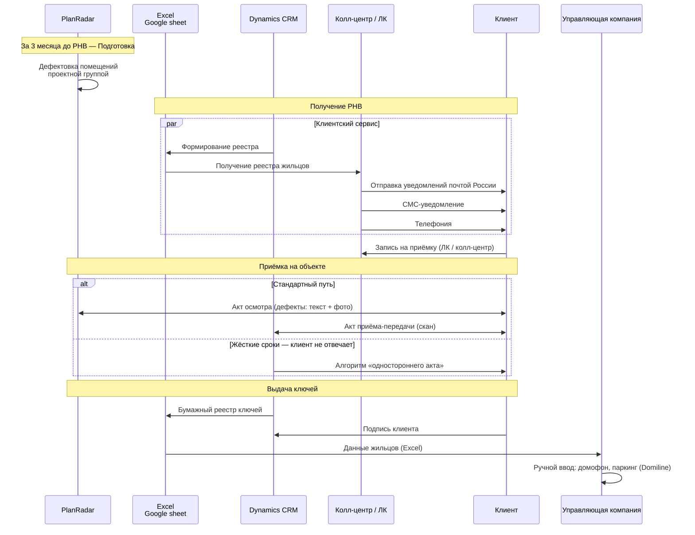

<!-- Space: IT -->
<!-- Parent: IT инфраструктура -->
<!-- Parent: ИС -->
<!-- Parent: ESB & DLH -->

# Процесс заселения в Glorax [07.05.26]

## 1. Схема процесса

<!-- Macro: ```mermaid-cloud\n([\s\S]*?)```
     Template: #mermaid-cloud
     mermaid-cloud: |
       <ac:structured-macro ac:name="mermaid-cloud" ac:schema-version="1">
       <ac:parameter ac:name="toolbar">bottom</ac:parameter>
       <ac:parameter ac:name="format">svg</ac:parameter>
       <ac:parameter ac:name="zoom">fit</ac:parameter>
       <ac:plain-text-body><![CDATA[${1}]]></ac:plain-text-body>
       </ac:structured-macro> -->



## 2. Хранение данных и системы

| Данные / процесс | Где хранится / ведётся |
|---|---|
| Дефекты, акты осмотра | **PlanRadar** |
| Статусы готовности, АПП, сканы | **CRM Dynamics** |
| История контактов с клиентом (обзвон, СМС) | **Excel / Google Таблицы** (ручной ввод) |