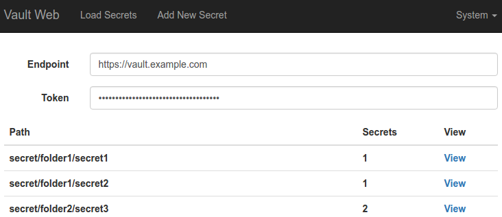

[]:# (Space: ODP)
[]:# (Parent: 04_Technology Stack)
[]:# (Parent: Service Creation Tools)
[]:# (Parent: CI/CD)
[]:# (Title: Artifact Repository)

# Inline



# Reference
![reference][image]

[image]: image.png 

```
code with ticks
```
    more code
    Indent
