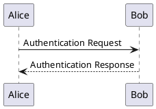
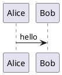

A diagram the info string names:

```plantuml title Alice and Bob
@startuml
Alice -> Bob: Authentication Request
Bob --> Alice: Authentication Response
@enduml
```

A diagram with no name of its own:

```plantuml
@startuml
Alice -> Bob: hello
@enduml
```
